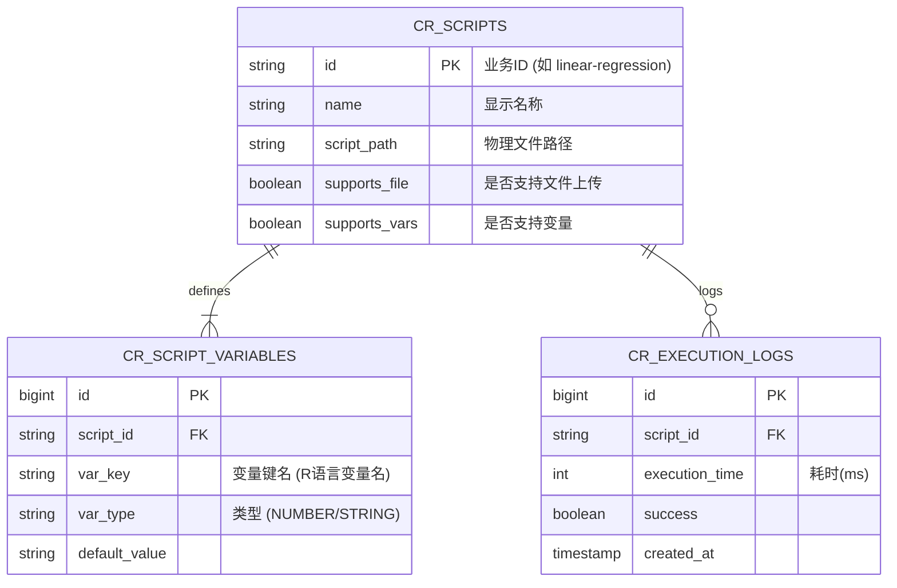

# 数据库设计文档 - Code Runner 模块

## 1. 设计概述

本模块主要涉及两类数据：

1. **静态元数据 (Metadata)**: 描述 R 脚本的定义、功能开关（是否支持文件上传）、以及它接受哪些参数变量。
2. **动态日志 (Logs)** (可选): 记录脚本的执行历史、耗时和状态，便于审计和优化。

> **命名规范**:
> * 表名使用 `snake_case`，建议加前缀 `cr_` (Code Runner) 以避免冲突。
> * 主键统一使用 `id`。
> * 逻辑删除字段统一使用 `is_deleted` (0/1)。
> 
> 

---

## 2. E-R 关系图



---

## 3. 表结构详解

### 3.1 脚本定义表 (`cr_scripts`)

用于存储 R 脚本的元数据。

| 字段名 | 类型 | 长度 | 必填 | 默认值 | 描述 |
| --- | --- | --- | --- | --- | --- |
| **id** | VARCHAR | 64 | **是** | - | **主键**，业务ID (如 `linear-regression`) |
| name | VARCHAR | 100 | 是 | - | 脚本名称 (UI显示) |
| description | VARCHAR | 500 | 否 | - | 脚本描述 |
| file_path | VARCHAR | 255 | 是 | - | `.R` 文件在服务器上的相对路径 |
| supports_variables | TINYINT | 1 | 是 | 0 | 是否支持自定义参数 (1:是, 0:否) |
| supports_file_input | TINYINT | 1 | 是 | 0 | 是否支持文件上传 (1:是, 0:否) |
| file_input_desc | VARCHAR | 255 | 否 | - | 文件上传的提示文案 (如 "请上传CSV") |
| created_at | DATETIME | - | 是 | NOW | 创建时间 |
| updated_at | DATETIME | - | 是 | NOW | 更新时间 |
| is_deleted | TINYINT | 1 | 是 | 0 | 逻辑删除 |

### 3.2 脚本变量配置表 (`cr_script_variables`)

定义每个脚本允许用户修改的参数（对应 API 中的 `variables` 列表）。

| 字段名 | 类型 | 长度 | 必填 | 默认值 | 描述 |
| --- | --- | --- | --- | --- | --- |
| **id** | BIGINT | 20 | **是** | AUTO | **主键**，自增 |
| script_id | VARCHAR | 64 | 是 | - | **外键**，关联 `cr_scripts.id` |
| name | VARCHAR | 50 | 是 | - | 变量名 (对应 R 代码中的变量) |
| label | VARCHAR | 50 | 是 | - | 前端表单显示的标签名 |
| type | VARCHAR | 20 | 是 | 'STRING' | 变量类型: `NUMBER`, `STRING`, `BOOLEAN` |
| default_value | VARCHAR | 100 | 否 | - | 默认值 (存储为字符串，运行时转换) |
| description | VARCHAR | 200 | 否 | - | 变量的帮助说明 |
| sort_order | INT | 4 | 是 | 0 | 前端表单的排序权重 |

### 3.3 执行日志表 (`cr_execution_logs`)

(可选) 用于记录每次调用的情况。

| 字段名 | 类型 | 长度 | 必填 | 描述 |
| --- | --- | --- | --- | --- |
| **id** | BIGINT | 20 | **是** | **主键** |
| script_id | VARCHAR | 64 | 是 | 关联脚本ID |
| request_params | TEXT | - | 否 | 记录请求参数 (JSON格式，便于排查) |
| is_success | TINYINT | 1 | 是 | 执行状态 (1:成功, 0:失败) |
| error_message | TEXT | - | 否 | 如果失败，记录错误信息 |
| execution_time_ms | BIGINT | 20 | 是 | 脚本执行耗时 (毫秒) |
| created_at | DATETIME | - | 是 | 执行时间 |

---

## 4. SQL 初始化脚本 (MySQL 8.0+)

```sql
-- 创建 Code Runner 模块所需的表

-- 1. 脚本主表
CREATE TABLE IF NOT EXISTS `cr_scripts` (
  `id` VARCHAR(64) NOT NULL COMMENT '脚本业务ID',
  `name` VARCHAR(100) NOT NULL COMMENT '脚本名称',
  `description` VARCHAR(500) DEFAULT NULL COMMENT '描述',
  `file_path` VARCHAR(255) NOT NULL COMMENT 'R脚本文件名或路径',
  `supports_variables` TINYINT(1) DEFAULT 0 COMMENT '是否支持变量',
  `supports_file_input` TINYINT(1) DEFAULT 0 COMMENT '是否支持文件输入',
  `file_input_desc` VARCHAR(255) DEFAULT NULL COMMENT '文件输入说明',
  `created_at` DATETIME DEFAULT CURRENT_TIMESTAMP,
  `updated_at` DATETIME DEFAULT CURRENT_TIMESTAMP ON UPDATE CURRENT_TIMESTAMP,
  `is_deleted` TINYINT(1) DEFAULT 0,
  PRIMARY KEY (`id`)
) ENGINE=InnoDB DEFAULT CHARSET=utf8mb4 COMMENT='R脚本定义表';

-- 2. 脚本变量表
CREATE TABLE IF NOT EXISTS `cr_script_variables` (
  `id` BIGINT(20) NOT NULL AUTO_INCREMENT,
  `script_id` VARCHAR(64) NOT NULL COMMENT '关联脚本ID',
  `name` VARCHAR(50) NOT NULL COMMENT 'R变量名',
  `label` VARCHAR(50) NOT NULL COMMENT '前端显示名称',
  `type` VARCHAR(20) NOT NULL COMMENT '数据类型: NUMBER, STRING, BOOLEAN',
  `default_value` VARCHAR(100) DEFAULT NULL COMMENT '默认值',
  `description` VARCHAR(200) DEFAULT NULL COMMENT '变量说明',
  `sort_order` INT(11) DEFAULT 0 COMMENT '排序',
  PRIMARY KEY (`id`),
  KEY `idx_script_id` (`script_id`)
) ENGINE=InnoDB DEFAULT CHARSET=utf8mb4 COMMENT='脚本变量配置表';

-- 3. 执行日志表
CREATE TABLE IF NOT EXISTS `cr_execution_logs` (
  `id` BIGINT(20) NOT NULL AUTO_INCREMENT,
  `script_id` VARCHAR(64) NOT NULL,
  `is_success` TINYINT(1) NOT NULL,
  `execution_time_ms` BIGINT(20) DEFAULT 0,
  `error_message` TEXT,
  `created_at` DATETIME DEFAULT CURRENT_TIMESTAMP,
  PRIMARY KEY (`id`),
  KEY `idx_create_time` (`created_at`)
) ENGINE=InnoDB DEFAULT CHARSET=utf8mb4 COMMENT='脚本执行日志';

-- 4. 插入初始化演示数据 (对应 API 文档)
INSERT INTO `cr_scripts` (`id`, `name`, `description`, `file_path`, `supports_variables`, `supports_file_input`, `file_input_desc`) 
VALUES 
('basic-stats', '基础统计分析', '计算数据的基本统计量', 'basic_stats.R', 0, 1, '请上传包含数值数据的 CSV 文件'),
('linear-regression', '线性回归分析', '执行简单线性回归并生成图表', 'linear_regression.R', 1, 1, '请上传包含 x 和 y 两列数据的 CSV 文件');

INSERT INTO `cr_script_variables` (`script_id`, `name`, `label`, `type`, `default_value`, `description`, `sort_order`) 
VALUES 
('linear-regression', 'sample_size', '样本数量', 'NUMBER', '100', '生成的样本数量 (10-1000)', 1),
('linear-regression', 'noise_level', '噪声水平', 'NUMBER', '0.5', '数据噪声干扰程度', 2);

```

---

## 5. JPA Entity 映射示例

在 Spring Boot 中，使用 JPA 实体来映射上述表结构。

### 5.1 Script Entity (`RScriptEntity.java`)

```java
package com.example.project.modules.coderunner.model.entity;

import jakarta.persistence.*;
import lombok.Data;
import org.hibernate.annotations.Where;
import java.util.List;

@Data
@Entity
@Table(name = "cr_scripts")
@Where(clause = "is_deleted = 0") // 默认只查询未删除的
public class RScriptEntity {
    
    @Id
    @Column(length = 64)
    private String id; // 手动分配的 String ID (如 linear-regression)

    private String name;
    
    private String description;
    
    @Column(name = "file_path")
    private String filePath;

    @Column(name = "supports_variables")
    private Boolean supportsVariables;

    @Column(name = "supports_file_input")
    private Boolean supportsFileInput;

    @Column(name = "file_input_desc")
    private String fileInputDesc;

    // 一对多关联：获取该脚本下的所有变量配置
    @OneToMany(mappedBy = "script", fetch = FetchType.EAGER)
    @OrderBy("sortOrder ASC")
    private List<ScriptVariableEntity> variables;
}

```

### 5.2 Variable Entity (`ScriptVariableEntity.java`)

```java
package com.example.project.modules.coderunner.model.entity;

import jakarta.persistence.*;
import lombok.Data;
import lombok.ToString;

@Data
@Entity
@Table(name = "cr_script_variables")
public class ScriptVariableEntity {
    
    @Id
    @GeneratedValue(strategy = GenerationType.IDENTITY)
    private Long id;

    // 多对一关联：回到 Script
    @ManyToOne
    @JoinColumn(name = "script_id")
    @ToString.Exclude // 防止 Lombok 循环引用
    private RScriptEntity script;

    private String name;   // R 变量名
    private String label;  // 前端显示名
    
    @Enumerated(EnumType.STRING)
    private VariableType type; // 枚举: NUMBER, STRING, BOOLEAN

    @Column(name = "default_value")
    private String defaultValue;
    
    private String description;
    
    @Column(name = "sort_order")
    private Integer sortOrder;
    
    public enum VariableType {
        NUMBER, STRING, BOOLEAN
    }
}

```